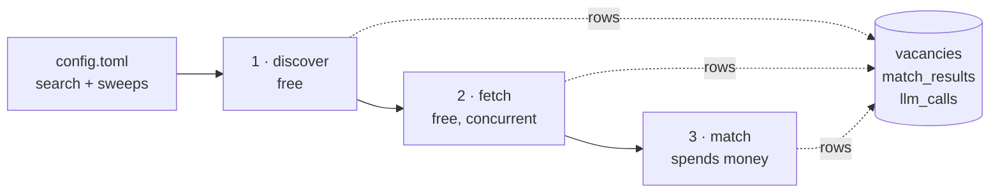
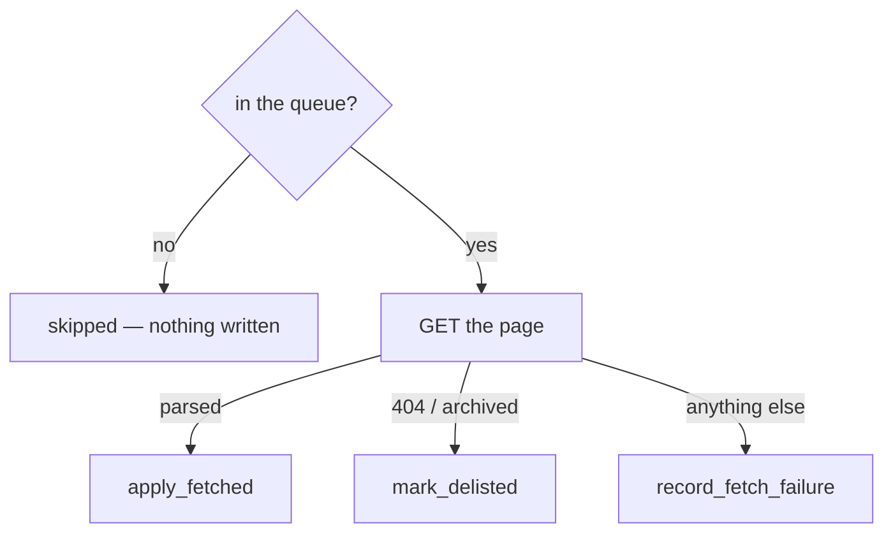

# The pipeline, step by step

`jobmatch run` is three phases over one table. The point of this document is the
**after** of each one: what is on disk when a phase ends, and therefore what a
re-run has to do and what it can skip.

Everything persists to Postgres (`docker-compose.yml`, host port 5433, volume
`cv_pgdata`). Nothing is written to files. There is no cursor, no queue table and
no run record: every guard is a condition on the rows, so a re-run resumes by
looking at the data.



---

## 1 · Discover

**Reads** the sweeps in `config.toml`. Each country expands via
`areas.coverage()` into the queries needed to stay under hh's 2 000-per-query
ceiling — one for Belarus, 92 for Russia. Listings come from the page's embedded
state, not the markup, because the markup renders only the first 20 of 50.

**Writes** one `vacancies` row per posting, `upsert_listing`, committed before any
further network call. One statement with `ON CONFLICT`, so there is no
read-modify-write race.

### After this step

| column | state |
|---|---|
| `source`, `external_id` | set — the natural key, unique together |
| `url`, `title`, `published_at` | set from the feed; a stored value wins over the feed's thinner version |
| `first_seen_at`, `last_seen_at` | `last_seen_at` bumped on every sighting |
| `description`, `fetched_at`, everything else | **untouched** |

A row with `fetched_at IS NULL` is a valid, first-class state — not a failure. It
*is* the fetch queue.

**Re-running** is free and idempotent: a second discover of the same posting only
moves `last_seen_at`. Nothing it wrote is ever lost by a later phase.

`jobmatch discover` runs this phase alone and reports `discovered N (M new)`,
which is what tells a config change apart from a re-crawl. `--limit` stops the
walk rather than trimming the result, so trying a changed search costs a page
instead of a sweep.

---

## 2 · Fetch

**Reads** the queue: `fetched_at IS NULL AND delisted_at IS NULL AND
fetch_attempts < MAX_FETCH_ATTEMPTS`, oldest first. The partial index
`ix_vacancies_fetch_queue` has exactly that predicate.

**Concurrent** — `rate.workers` pages in flight, each worker sleeping `rate.delay`
after its own page, so the request rate is `workers / delay` per second. The
source states its own measured value (`sources/hh` RATE). Workers are
coroutines, so the rate holds per process: two processes crawling hh at once
double it.

Three outcomes, each its own transaction, so one bad page costs a warning:



### After this step

| outcome | what changed |
|---|---|
| **fetched** | `description`, `skills`, `salary_raw`, `experience_raw`, `company`, `country`, `work_formats`, `raw` filled; `fetched_at` set; `fetch_attempts` reset to 0; `fetch_error` and `delisted_at` cleared. The page's `published_at` beats the feed's. |
| **delisted** | `delisted_at` set, `fetch_error` cleared. Leaves the queue for good; never retried, because a 404 is the employer's doing. |
| **failed** | `fetch_attempts += 1`, `fetch_error` set to `Type: message`. Stays in the queue until attempts run out. |

The row has left the queue exactly when `fetched_at` is set or `delisted_at` is
set or attempts are exhausted — nothing marks it "done" separately.

**Re-running** (`jobmatch fetch --pending`) picks up whatever is still in the
queue and no more: a success simply isn't in it any longer. Safe to run any
number of times. A re-fetch of an already-fetched row only happens if you clear
`fetched_at` yourself.

---

## 3 · Match

The only phase that costs money. It walks the **table**, not the feed — the feed
is a rolling window and the corpus outgrows it, so a posting stored last week is
still matched when the CV changes.

**Reads** every vacancy with `fetched_at IS NOT NULL AND description IS NOT
NULL`, scoped to the configured sources.

`matching.CONCURRENCY` calls are in flight at once. `--limit` stays exact under
that: a slot is reserved before a call goes out and handed back if it fails, so
a failed call does not count against the limit.

**The fingerprint is the whole idempotency rule:**

```
sha256( CV + job text + questions + model )
```

Everything that should invalidate a stored answer flows through it — a reworded
question, an edited CV, a new redaction rule, an edited posting, a different
pinned model. There is no version constant to forget to bump.

```mermaid
flowchart TD
    fp["fingerprint the request"] --> known{"a row with this<br/>fingerprint exists?"}
    known -->|"yes, current"| free["nothing written — free"]
    known -->|"yes, superseded"| revive["revive it, supersede the other — free"]
    known -->|no| ask["ask Jev"]
    ask --> call["llm_calls row written<br/>win or lose"]
    call -->|ok| save["supersede the current row,<br/>insert the new answer"]
    call -->|error| stop["failure recorded, run continues"]
```

### After this step

| table | state |
|---|---|
| `llm_calls` | one row per *attempt*, `status` `ok` or `error` — with `cost_usd`, `duration_ms`, `error_type`. Committed in its own session, so the spend is on record even when the match then fails. |
| `match_results` | one row per paid answer that parsed. Append-only; the only update is stamping `superseded_at`. |
| `vacancies.content_hash` | set to the job text's hash — the cheap pre-check for "the employer edited the posting" |

**`superseded_at IS NULL` means current, not correct.** Superseded means another
request answered afterwards. A partial unique index makes "one current row per
vacancy" the database's problem, so two concurrent runs cannot both leave one.

**Nothing is ever deleted.** Answers from an earlier CV stay queryable — which is
how the market view can still report on a CV whose answers have all been
superseded.

**Re-running** costs nothing where nothing changed: the lookup is one indexed
read per vacancy, on `uq_match_results_vacancy_fingerprint`. Reverting a CV to a previous version *revives* the
matching rows instead of re-buying them.

---

## What survives what

| you do this | and this is still true |
|---|---|
| re-run `discover` | every description and every answer is untouched |
| re-run `fetch` | every answer is untouched — `apply_fetched` writes only `vacancies` columns |
| re-fetch a page that changed | the old answer survives as superseded; the next `match` pays for a new one |
| re-fetch a page that didn't change | the fingerprint is identical, so the next `match` is free |
| edit the CV | old answers kept, new ones bought; revert and the old ones revive |
| hide a vacancy | `hidden_at` is set; the row stays |
| **`DELETE FROM vacancies`** | **its answers go too — `match_results.vacancy_id` is `ON DELETE CASCADE`.** Use `hidden_at`. |
| `docker compose down -v` | nothing survives. There is no backup; the data is only in the `cv_pgdata` volume. |

`Stale` — unseen by discovery for `STALE_AFTER` (14 days) — is derived at read
time from `last_seen_at` and never stored. A stored flag would need a job to
maintain it and would be wrong between runs.

---

## Running the phases on their own

```bash
jobmatch run                   # all three
jobmatch run --only bg         # one sweep
jobmatch run --no-match        # phases 1-2, spend nothing
jobmatch run --limit 3         # pay for at most 3 matches

jobmatch discover              # phase 1 alone, no pages pulled
jobmatch discover --limit 20   # ...and stop the walk after 20 listings
jobmatch fetch --pending       # phase 2 alone, over what is stored
jobmatch match                 # phase 3 alone, no crawling
jobmatch match --dry-run       # ask and print, write nothing
```

Each phase leaves a state the next one reads, so you can stop after any of them
and resume later. The three `--limit` flags cap different things, because the
phases cost different things: listings walked, pages fetched, and money spent.

`--no-match` loses nothing: the stored rows are the queue, and `jobmatch match`
picks up exactly where it stopped. `--dry-run` is the exception to "the spend is
always on record" — it writes no `llm_calls` row, so its cost is printed and
nowhere else.
